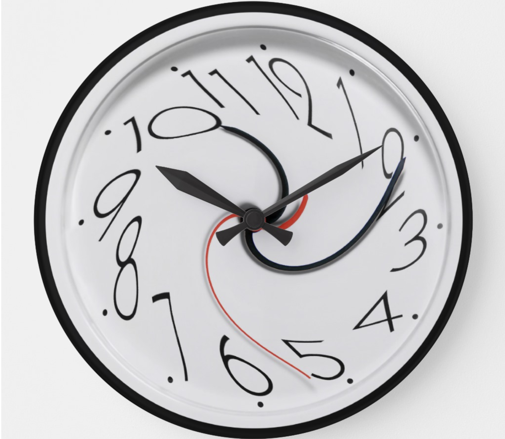

# Crazy Clock - Lab

## The Goal
In this lab, we will be creating a clock that changes depending on the time that is being displayed. It might not be the most useful clock, but it will definitely be interesting to look at.

## Getting Started

1. Clone this repository using `git clone`
2. `cd` into the project folder
3. `npm install`
4. `npm start`

## The Lab
1. Using inline styling, set the font color of the hours to red
2. Using inline styling, set the font color of the minutes to orange
3. Using inline styling, set the font color of the seconds to purple
4. If the time is before noon, set the background color of the of clock to yellow.
5. If the time is after noon, set the background color of the clock to blue
6. If the amount of minutes is greater than 30, change the font color to green.
7. If the minute is an EVEN number, the time should be displayed in bold
8. If the minute is an ODD number, change the time to a different font.
9. Set the font size (in px) of the seconds to the amount of seconds that have passed (ex: 32 seconds should have a font-size of 32px).
10. Every 15 seconds, change the font color of the hours to a random color.

## Extensions
1. Add text on top of the clock that says "Good Morning!" before 12pm, "Good Afternoon" between 12pm and 7pm, and "Good Night" between 7pm and 12am.
2. Have the background color become a DARKER shade of yellow from hour 0 to hour 12. Have the background color become a DARKER blue from the hour 12 to hour 24 (almost black by hour 24).
3. Rotate the clock (in degrees) by the amount of seconds*6 that have passed.
4. Add box-shadow to clock that is on the left before 12 and is on the right after 12.
